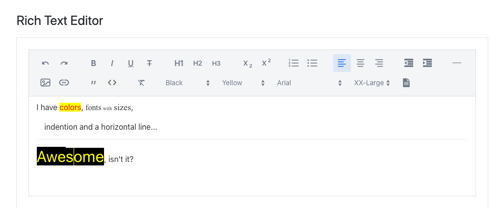

# alump's fork of vaadin-rich-text-editor

Notice this fork keeps the original license. So you need to have license to use vaadin-rich-text-editor.

This is my custom version of vaadin-rich-text-editor.
It adds following features:

- Font size/family/color/background pickers
- Horizontal line support
- Indentation support
- Additional server side handled toolbar buttons (WIP)
- Moah...



## Develop (Bower)

This project is still written with Polymer 2, and using Bower. This mode can be used when developing it. Notice that
this is planned to be released as Polymer 3 / NPM, and next section covers that

> npm install

Bower install might offer versions for dependencies. Select 1.5.0 for vaadin-lumo-styles.
> bower install

> npm start

These steps will get demo app running. Add /demo to end of URL to see the demo page.


## Compile NPM

This guide is to get a local Polymer 3 / NPM version, that can be used to test it with alump-vaadin-rich-text-editor-flow.

### Tools needed
> npm install -g polymer-modulizer
> npm iinstal -g magi-cli
> npm install -g husky

### Make sure naming and version is correct at package.json and bower.json
Just make sure you have updated naming and versioning on these files before running the following steps. package.json will
get replaced, but naming and versioning will be kept.

### Convert to Polymer 3
As this project is/was originally done with bower / Polymer 2, it has to be converted to npm and Polymer 3 before npm package
can be create. Following steps will convert the project. Notice that it will create commit and radically change the project
setup. To return back to initial state, just stash, and reset HEAD~1 and clean -f the changes with git.
> rm -fr bower_components node_modules && bower i && magi p3-convert --out . --import-style=name
> npm install

### Run
> polymer serve --npm --module-resolution=node --port=3000 -H 127.0.0.1 --open

### Release your own version
This step assumes you have updated the package info to point to your personal NPM repository naming. Also make sure your
version is correct.

> npm publish --access=public

### Flow parts to use app on Vaadin 14+

Repository for flow parts: [github.com/alump/alump-vaadin-rich-text-editor-flow](https://github.com/alump/alump-vaadin-rich-text-editor-flow)

## Known issues

### git commit issues
Use no-verify, I haven't spent time making sure verify steps work
> git commit --no-verify

## Release history

### 1.2.0-alump5
- Minor bug fixes (mainly event handling)
- Upgrade dependendencies to Vaadin 14.2

### 1.2.0-alump4
- Adding index option to data entry method to make sure it will get right location event after the server round trip.
- Add white space before data entry if at index 0: Quill Bug: https://github.com/quilljs/quill/issues/3045
- Fix typo in I18N key
- Add selection lenght value to server-button-clicked even for future use

### 1.2.0-alump3 - 1.2.0-alump1 (unpublished)
- alump3: Convert data entry to inline element to not break blocks
- alump2: Adjusted dependendencies to be more strict on versions
- alump1: First try


# Original README...


[](https://www.npmjs.com/package/@vaadin/vaadin-rich-text-editor)
[](https://github.com/vaadin/vaadin-rich-text-editor/releases)
[](https://www.webcomponents.org/element/vaadin/vaadin-rich-text-editor)
[](https://travis-ci.org/vaadin/vaadin-rich-text-editor)
[](https://coveralls.io/github/vaadin/vaadin-rich-text-editor?branch=master)
[](https://gitter.im/vaadin/web-components?utm_source=badge&utm_medium=badge&utm_campaign=pr-badge)

 [](https://vaadin.com/directory/component/vaadinvaadin-rich-text-editor)
[](https://vaadin.com/directory/component/vaadinvaadin-rich-text-editor)


# &lt;vaadin-rich-text-editor&gt;

[Live Demo ↗](https://cdn.vaadin.com/vaadin-rich-text-editor/1.0.0-alpha6/demo/)
|
[API documentation ↗](https://cdn.vaadin.com/vaadin-rich-text-editor/1.0.0-alpha6)


[&lt;vaadin-rich-text-editor&gt;](https://vaadin.com/components/vaadin-rich-text-editor) is a Web Component providing rich text editor functionality, part of the [Vaadin components](https://vaadin.com/components).

<!--
```
<custom-element-demo>
  <template>
    <script src="../webcomponentsjs/webcomponents-lite.js"></script>
    <link rel="import" href="vaadin-rich-text-editor.html">
    <next-code-block></next-code-block>
  </template>
</custom-element-demo>
```
-->
```html
<vaadin-rich-text-editor>
  ...
</vaadin-rich-text-editor>
```

[](https://vaadin.com/components/vaadin-rich-text-editor)


## Installation

The Vaadin components are distributed as Bower and npm packages.
Please note that the version range is the same, as the API has not changed.
You should not mix Bower and npm versions in the same application, though.

Unlike the official Polymer Elements, the converted Polymer 3 compatible Vaadin components
are only published on npm, not pushed to GitHub repositories.

### Polymer 2 and HTML Imports compatible version

Install `vaadin-rich-text-editor`:

```sh
bower i vaadin/vaadin-rich-text-editor --save
```

Once installed, import it in your application:

```html
<link rel="import" href="bower_components/vaadin-rich-text-editor/vaadin-rich-text-editor.html">
```

### Polymer 3 and ES Modules compatible version


Install `vaadin-rich-text-editor`:

```sh
npm i @vaadin/vaadin-rich-text-editor --save
```

Once installed, import it in your application:

```js
import '@vaadin/vaadin-rich-text-editor/vaadin-rich-text-editor.js';
```

## Getting started

Vaadin components use the Lumo theme by default.

To use the Material theme, import the correspondent file from the `theme/material` folder.

## Entry points

- The component with the Lumo theme:

  `theme/lumo/vaadin-rich-text-editor.html`

- The component with the Material theme:

  `theme/material/vaadin-rich-text-editor.html`

- Alias for `theme/lumo/vaadin-rich-text-editor.html`:

  `vaadin-rich-text-editor.html`


## Running demos and tests in a browser

1. Fork the `vaadin-rich-text-editor` repository and clone it locally.

1. Make sure you have [npm](https://www.npmjs.com/) and [Bower](https://bower.io) installed.

1. When in the `vaadin-rich-text-editor` directory, run `npm install` and then `bower install` to install dependencies.

1. Make sure you have [polymer-cli](https://www.npmjs.com/package/polymer-cli) installed globally: `npm i -g polymer-cli`.

1. Run `npm start`, browser will automatically open the component API documentation.

1. You can also open demo or in-browser tests by adding **demo** or **test** to the URL, for example:

  - http://127.0.0.1:3000/components/vaadin-rich-text-editor/demo
  - http://127.0.0.1:3000/components/vaadin-rich-text-editor/test


## Running tests from the command line

1. When in the `vaadin-rich-text-editor` directory, run `polymer test`


## Following the coding style

We are using [ESLint](http://eslint.org/) for linting JavaScript code. You can check if your code is following our standards by running `npm run lint`, which will automatically lint all `.js` files as well as JavaScript snippets inside `.html` files.


## Big Thanks

Cross-browser Testing Platform and Open Source <3 Provided by [Sauce Labs](https://saucelabs.com).


## Contributing

  To contribute to the component, please read [the guideline](https://github.com/vaadin/vaadin-core/blob/master/CONTRIBUTING.md) first.


## License

Commercial Vaadin Add-on License version 3 (CVALv3). For license terms, see LICENSE.

Vaadin collects development time usage statistics to improve this product. For details and to opt-out, see https://github.com/vaadin/vaadin-usage-statistics.
